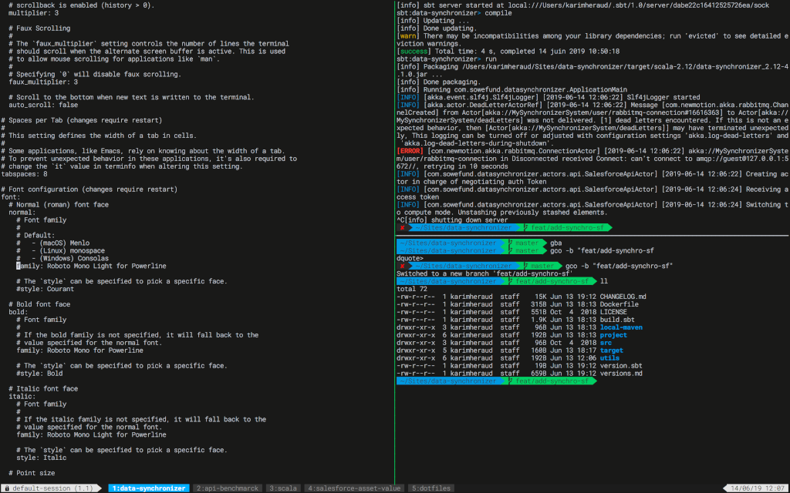

# Personal dotfiles

## Introduction

> Here for personal use, use at your own risk



## Installation

```
$ git clone https://github.com/kheraud/dotfiles.git ~/.dotfiles
$ cd ~/.dotfiles
$ git submodule update --init --recursive
$ ./install
```
